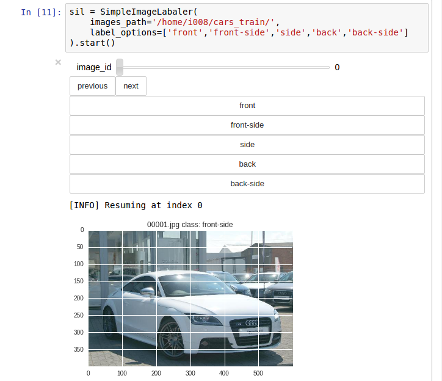
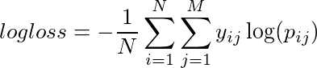

### Project summary

The main goal of this project is to find out if its feasable to create an image classifier, capable of detecting   
images of car and the perspective from wich the photo was taken (front-side, back-side, side, back, front) None of the 
"Computer-Vision-As-A-Servie" providers gives you enough  detailed informations to solve this problem with a 
simple API call.  

We will try different approaches:
- Train a CNN from scratch using the limited data we have
- Use pretrained models (resnet, vgg19, overfeat) to extract features(output from last convolutional layers)  
 from our dataset.
- Use "classical" computer vision techniques and image descriptors (like HOG)
- We build an ensamble of the above to make an stronger (hopefully) classifier

---
### 1) Labeling the Data

The firs step in order to start working on this problem is labeling some car pictures based on the perspective.
We hope that using transfer learning and heavy image augumentation we will be able to achieve decent accuracy with very 
little data (few hundred images per class)

The stanford cars data set was re-labaled for this purpose  
http://ai.stanford.edu/~jkrause/cars/car_dataset.html

Labeling guidelines:  
- front-side, front LP(license plate) visible, 2 wheels visible
- front, front LP visible, no wheels visible
- back, back LP visible, no wheels visible
- back-side, back LP visible, 2 wheels visible
- side, no LP visible, 2 wheels visible

As you can imagine with pretty simple guidelines like that some times choosing the right class can be tricky.

To make the labeling process smoother, i wrote z simple jupyter widget to make labeling easier
  

---
### 2) Training data summary, fighting class imbalance
|label_count|label|
|--- |---|
|196|back|
|512|front|
|952|side|
|1084|back-side|
|5246|front-side|

(class counts df here)  
(mention problems with class imbalance and possible solutions to  fight it)  

---
### 2) Preparing the folder structure

